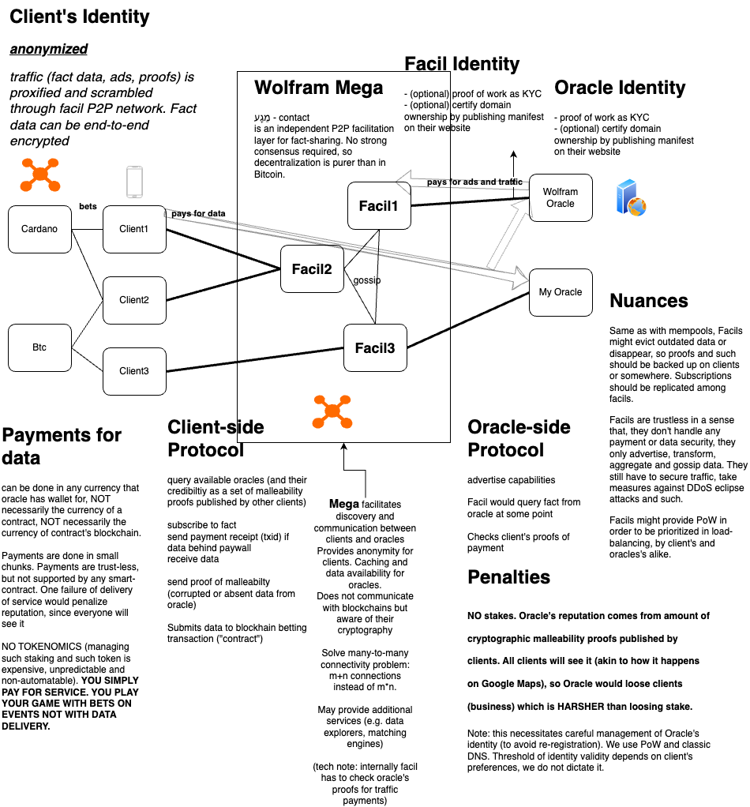

A p2p fact sharing network

# Wolfram Mega

Mega *(from מַגָע, contact, pornounced as maga/m'ga)* - is a lightweight infinitely scalable decentralized data marketplace, bringing authentic observers to blockchain.

*Note: this is proof of concept*

---------

## Run

```
git clone <github-repo>
cd wolfram-mega
npm run peer mempool-cfg.json
npm run peer mempool-cfg2.json
npm run peer mempool-cfg3.json
```
Monitoring, REST and swagger would become avialable at:

http://localhost:8080/index.htm, http://localhost:8081/index.htm, http://localhost:8082/index.htm

P2P network uses [Bicoin protocol structure](https://en.bitcoin.it/wiki/Protocol_specification#Message_structure) for communication.

Tests:

```
npm i c8 -g
npm run test
npm run it
```
-----
Configuration:

p2p network is discovered from `p2pseed`, see example at [mempool-cfg2.json](mempool-cfg2.json). Specifying `hostname` would make your node discoverable. `httpPort` is port for REST, `p2pPort` is port for P2P gossiping.

Optional `mempool-cfg` config parameters:
- `isTest` enables `testOnly` REST endpoints for convenience. 
- `facilitatorId`: `facilitatorId.rewardAddress` is lightning address for rewards (microbids),  `facilitatorId.facilitatorRewardIdPow` would allow you to establish identity for rewards.
- `lnRestHost`, `lnMacaroonPath` are used to verify proofs of payments for rewards.
- `p2pKeepAlive` how often (milliseconds) your peer would remind network about itself.

--------

## Aims
Unlike mainstream solutions (e.g. chainlink), Mega is not concerned with speculative stakes made by resellers of original data. It is not concerned with illusion of security provided by voting with questionable coins that have no other value than the one assigned by stakers themselves.

### Strong identity.

(stronger identities allow for weaker assumptions about their malleability)

Oracles in Mega are either not anonymous at all (e.g. Wolfram Alpha) or have reliable pseudonymous identitites supported by proof-of-work. Identity in Mega is treated as NOT "something confirmed by your human peers", but something that rather requires effort (physical work) to aquire.

### True Data Authenticity

Network keeps **original** data authentication. Mega-operators don't sign data, in fact, they don't even see what data is provided, unless anomaly is reported. Their main concern is to connect trader to an authentic source.

Thus, Mega even allows for dealing with exclusive data - where no alternative data provider practicaly exists, so no reliable quorum-based contracts can be established in principle. Instead of dealing with smokescreen of pseudo-oracles, you get the original authentic data, but with additional assurance from P2P network keeping track of "data crimes".

### Full accountability

Public reporting rather than (micro)slashing

Mega's primary (although not exclusive) way of assurance of quality of data is through reporting oracle faults. It is not exclusively limited to proofs verifiable by machines, it also includes human-interpretable ones. Reputation system is natural and based on such "reports of malleability". 

Traders can simply see what is formally and verifiably reported about oracle, which means oracle has whole "business" identity at stake, not some coins. Actual responsibility, actual consequences are invoked. *While, from user perspective, this approach is most suitable to microbets on future events, it does neither exclude nor neccistates additional (but more expensive) "assurance" provided by monetary collateral under a guard of quorum of oracles "slashing" - mega is compatible with it, just "how much do you actually know about oracle counterparties, are they really independent, do stakes really stop them from anonymous conspiracy?".*

Since many types of reports are still machine-verifiable, users/traffic can be diverted automatically from suspicious oracles.

### Direct payments

Mega avoids speculative tokenomics. Rewards for providing data as well as incentives for p2p facilitators are direct. Thus we don't have "automated market makers" (market making is not automatable), Web3 and other stuff that disagrees with common sense and comes out of simply not understanding purpose and mechanics of free market.

The main disadvantage of coins having no intrinsic value is low security of the network against financial attacks (see ["deadpool attack"](https://forum.cardano.org/t/deathpool-attack-on-any-pos/143677)).

Nevertheless, nothing stops you from paying with "WolframCoin" though if you buy attestations from Wolfram - it is just not necessary for the functioning of the network. Only PoW is.

### Open protocol

Since Mega only needs operators to be able to manage basic network security (opening ports, avoiding DDoS and eclipse attacks), there is no entry bar to join it rather than basic proficiency. We don't have to consult operators about security or pretend that we are independent advisers. In our case, P2P network does not depend on us at all. 

We specify protocol, mostly in declarative terms. We provide reference implementation and [swagger spec](wolfram-mega-spec.yaml). 

We only benefit from the fact that we actually provide most interesting data (to us at least!) so far (cool sports bets, political events bets, even bets on scientific discoveries).

--------

## Means

Mega's P2P network acts as an ad-hoc registry of:

- oracles with pubkey identiffication (KYC) supported by proof-of-work (pseudonimity) and/or by a manifest published on a reputable website (linking to pubkey).
- oracle capabilities (questions they can answer) signed with oracle's pubkey
- proofs of oracle malleabilty, submitted by traders/clients: data conflict with other oracles ("I say 6, you say 9"), data disagreeing with "human consesus", not providing data in exchange for micropayment recieved or any other type of report (e.g. a link to nostr post/thread).

The decentrilized registry is organized simillarly to "bitcoin mempool", except it is aimed at preserving "unordered collection of advertisements and malleability reports", thus does not require its own or any blockchain (consensus over order) to operate. 

Incentives. Since, unlike with btc mempools, rewards are not attached to such registry entries, oracles can reward Mega-operators by paying (microbiding using btc-ln) for "ad-placement", for making oracle's identity available in the network. 

Security. Such registries are subject to spam-attacks since anyone can create oracle, submit any report etc. We use hascash (proof-of-work) to address that, since it was it's original purpose before Bitcoin came in. Basicaly node evicts ads and reports with lowest PoW.

Sharding and availability. Since some data losses are acceptable (traders/oracles/orgs can resubmit their data to the network) and avilability can always increase through pow-difficulty (and oracles microbidding with BTC-LN), nodes are at the liberty of evicting data randomly (hash mod n) - this effectively increases data capacity. Alice's node can have half of malleability proofs, while Bob's node can the other half. Both halves would be available to a trader. Network can also withstand split-brains and general segmentations, thanks to eventual consistency.

------
Types of public proofs of malleability currently supported:

- fact conflict: oracle disagrees with others. Can be verified semi-automatically, since user would have to specify a policy and filter which oracles they would trust (even large quorum by itself is unreliable, have to "hand-pick").
- oracle did not provide data in exchange for payment. Verified  based on an off-chain contract signed by oracle (no need for blockchain, just crypto-signature). Payments and, in many cases, absense of data can be verified automatically, caches databases can be checked. This proof can be disputed by oracle through posting answer to the question. 
    - Stronger, but more expensive proof would be publishing data-points on chain, since blockchain would attest reliably to an SLA breach: "not providing data in time". Mega cannot be trusted with timestamps, since it is sensitive to timewarp attacks, so we can only attest to "absense of data so far", not "delay".
- fact reported by oracle disagrees with public. Can be verified (or at least flagged) automatically by looking it up on the internet or manually through review and DYR. Here, nostr links and such can be added.

Note: verification of proofs is "subjective". Wether automatically or not, verification has to happen on the client. Mega does not provide verifications themselves (although can prioritize reports in mempools based on some automatic ones), since it would require consensus stronger than btc. It only attests to reports filed.

We currently don't standardize SLA contracts, proofs of payments *(except for BTC-LN microbids as incentives - we support hash linking to invoice and experimental verification)*, we only necessitate some meta-fields. Format is generic, but specific formats for specific cases can be supported. 

We standardize parametrized questions (`FactRequest`) for example so whatever signed fact is, it must contain such question as well in order to be fully compatible with our system. Consequently minimal SLA contract, should at least contain fact-request (with non-empty invoice) signed by oracle.

------

Extras.

Protocol has a basic P2P matching engine (to advertise "option" offers), thus can act as P2P exchange for fully-collaterized derivatives. 

Since data is not limited to conventional future data, anything unknown can be advertised, e.g. solutions to mathematical problems, inverses of one-way functions, your husband's affairs etc.

Nodes potentially can cache signed data-points (mostly "slow facts") from oracles. They can also potentially pool, proxify and anonymize user data requests to protect users from oracles collecting private data.

Protocol can be extended to recognize and negotiate various types of "data contracts" between clients and oracles. E.g. user can order oracle to provide data on a local event, so he and his friend could bet on it. If oracle "scams" user - proof will be published, so oracle would have to abandon its PoW or website verified identity. And, more conventionally, it allows users to find (match) oracles with simillar capabilities to allow quorums and even "meaningful slashing" (security deposit from strongly identified oracle) on UtXO networks.

The approach is not limited to contracts which require oracles: finding a counterparty for a cryptogrphic betting can be facilitated too. Alice picks a number (sends encrypted number to blockchain) and asks Bob if Bob can guess it. If Bob guesses right - it gets Alice's deposit, otherwise looses its own. Rewind...they have to find one another on some sort of tinder first. This could be standardized in our protocol.

Securitization of malleability reports. Since PoW is done on reports, reports themselves can be "securitized" (become tradable) by publishing them (ideally zipped rather hashed) on Bitcoin blockchain using 'OP_RETURN' akin to inscriptions. Unlike with inscriptions, there is no need to "issue NFT asset", since a given report can be evaluated based on its PoW-difficulty * importance, so it can be fungible (just put n satoshis to the output). This would serve as a persitent database of most important reports.

--------


## Architecture



--------

"client APIs" milestone:
- oracle client REST API (can be on the same node, clients have to sign messages externally though)
- trader client REST API (can be on the same node, clients have to sign messages externally though)

"contracts demo" milestone
- integration with Bitcoin contracts (testnet)
- integration with Cardano Plutus contracts (testnet)
- note: generate contracts in client API

"documentation, viability and security assessment" milestone
- develop more test cases, attack vectors, add neccessary features like throttling
- deploy large scale p2p network, run serious performance tests
- develop versioning for p2p (future protocol upgrades) and dns p2p seed discovery
- ?consult third-party vendors
- model "financial attacks"
- write a white paper
- consider alternatives to node.js (e.g. c++, rust), pros and cons

"onboarding" milestone
- add support for other UtXO chains in client API (testnet)
- onboard oracles

